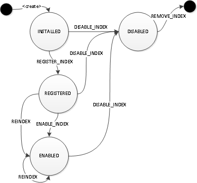

# 管理 Index Schema

## 1. Index 介紹

* **Index 是設定在各個 Property 上，因此需要先[建立 Property Schema](PropertySchemaManagement.md)**
* Graph Index 類型有2種：
    * Composite Index
    * Mixed Index

### (1) Composite Index

> 主要提供明確查詢使用，搜尋的速度較 **Mixed Index** 快

* 例如：

```groovy
g.V().has('name','JanusGraph');
```


---

### (2) Mixed Index

> 主要提供模糊查詢使用，例如：Full-Text Search、String Search、經緯度座標檢索...

* [官方文件](https://docs.janusgraph.org/index-backend/text-search/)

* Mixed Index 不支援這 3個函式，[官方文件](https://docs.janusgraph.org/index-backend/text-search/#tinkerpop-text-predicates)

```groovy
g.V().has('name', startingWith('uni'))
g.V().has('name', endingWith('corn'))
g.V().has('name', containing('nico'))
```

* Mixed Index 有4種 Mapping Parameters：

#### (A) Mapping.TEXT

> 用於 Full-Text Search

* [官方文件](https://docs.janusgraph.org/index-backend/text-search/#full-text-search_1)
* 支援以下函式：

```groovy
g.V().has('name', textContains('unicorns'));
g.V().has('name', textContainsPrefix('uni'));
g.V().has('name', textContainsRegex('.*corn.*'));
g.V().has('name', textContainsFuzzy('unicorn'));
```

* 如果 Backend 是使用 Elasticsearch，則額外支援以下函式：

```groovy
g.V().has('name', textNotContains('unicorns'));
g.V().has('name', textNotContainsPrefix('uni'));
g.V().has('name', textNotContainsRegex('.*corn.*'));
g.V().has('name', textNotContainsFuzzy('unicorn'));
```

---

#### (B) Mapping.STRING

> 用於 String Search

* [官方文件](https://docs.janusgraph.org/index-backend/text-search/#string-search)
* 支援以下函式：

```groovy
g.V().has('name', eq('unicorns'));
g.V().has('name', neq('unicorns'));
g.V().has('name', textPrefix('uni'));
g.V().has('name', textRegex('.*corn.*'));
g.V().has('name', textFuzzy('unicorn'));
```

---

#### (C)  Mapping.TEXTSTRING

> 可用於 Full-Text Search 和 String Search

* [官方文件](https://docs.janusgraph.org/index-backend/text-search/#full-text-and-string-search)
* 支援以下函式：

```groovy
// Full-Text Search
g.V().has('name', textContains('unicorns'));
g.V().has('name', textContainsPrefix('uni'));
g.V().has('name', textContainsRegex('.*corn.*'));
g.V().has('name', textContainsFuzzy('unicorn'));

// String Search
g.V().has('name', eq('unicorns'));
g.V().has('name', neq('unicorns'));
g.V().has('name', textPrefix('uni'));
g.V().has('name', textRegex('.*corn.*'));
g.V().has('name', textFuzzy('unicorn'));
```

* 如果 Backend 是使用 Elasticsearch，則額外支援以下函式：

```groovy
g.V().has('name', textNotContains('unicorns'));
g.V().has('name', textNotContainsPrefix('uni'));
g.V().has('name', textNotContainsRegex('.*corn.*'));
g.V().has('name', textNotContainsFuzzy('unicorn'));
```

---

#### (D) Mapping.PREFIX_TREE

> 用於經緯度座標檢索

* [官方文件](https://docs.janusgraph.org/index-backend/text-search/#geo-mapping)


---

## 2. Index Lifecycle

* [官方文件](https://docs.janusgraph.org/schema/index-management/index-lifecycle/)



* **States**
    * **INSTALLED**
        * The index is installed in the system but not yet registered with all instances in the cluster
    * **REGISTERED**
        * The index is registered with all instances in the cluster but not (yet) enabled
    * **ENABLED**
        * The index is enabled and in use
    * **DISABLED**
        * The index is disabled and no longer in use
* **Action**
    * **REGISTER_INDEX**
        * Registers the index with all instances in the graph cluster. After an index is installed, it must be registered with all graph instances
    * **REINDEX**
        * Re-builds the index from the graph
    * **ENABLE_INDEX**
        * Enables the index so that it can be used by the query processing engine. An index must be registered before it can be enabled.
    * **DISABLE_INDEX**
        * Disables the index in the graph so that it is no longer used.
    * **REMOVE_INDEX**
        * Removes the index from the graph (optional operation). Only on composite index.

> * **刪除的流程**
>     * **停用 Index** → **刪除 Index** (限 Composite Index)


---

## 3. 列出所有的 Index

* 執行 Gremlin

```groovy
// 開啟 JanusGraph Management
mgmt = graph.openManagement();

// 列出所有的 Index
mgmt.printIndexes();
```

* 顯示的結果

```
--------------------------------------------------------------------------------------------------
Vertex Index Name            | Type        | Unique    | Backing        | Key:           Status |
---------------------------------------------------------------------------------------------------
FlagIndex                    | Composite   | false     | internalindex  | flags:        ENABLED |
---------------------------------------------------------------------------------------------------
Edge Index (VCI) Name        | Type        | Unique    | Backing        | Key:           Status |
---------------------------------------------------------------------------------------------------
---------------------------------------------------------------------------------------------------
Relation Index               | Type        | Direction | Sort Key       | Order    |     Status |
---------------------------------------------------------------------------------------------------
```


---

## 4. 建立 Vertex Index

> **在建立 Graph Index 前，因此需要先[建立 Property Schema](PropertySchemaManagement.md)**


* **建立並啟用的流程**
    * **建立 Index** → **註冊 Index** → **啟用 Index**

### Step.1 建立 Index

#### (1) 建立 Composite Index

1. 先選擇要建立 Index 的 Property
2. 再設定以下資訊：
    * Index 的名稱
    * Vertex or Edge

```groovy
graph.tx().rollback();

// 開啟 JanusGraph Management
mgmt = graph.openManagement();

// 取得 Property
propertyKey = mgmt.getPropertyKey('<Your Property>');

// 建立 Index
mgmt.buildIndex('<Index Name>', Vertex.class).addKey(propertyKey).buildCompositeIndex();

// 提交
:> mgmt.commit();
```

---

#### (2) 建立 Mixed Index

1. 先選擇要建立 Index 的 Property
2. 再設定以下資訊：
    * Index 的名稱
    * Vertex or Edge
    * Backing Index Name
    * Mapping Parameters

```groovy
graph.tx().rollback();

// 開啟 JanusGraph Management
mgmt = graph.openManagement();

// 取得 Property
propertyKey = mgmt.getPropertyKey('<Your Property>');

// 建立 Index，設定 Index Name、Backing Index Name 和 Mapping Parameters
mgmt.buildIndex('<Index Name>', Vertex.class).addKey(propertyKey, Mapping.TEXTSTRING.asParameter()).buildMixedIndex("<Backing Index>");

// 提交
mgmt.commit();
```

---

### Step.2 查詢目前 Index 狀態

* **查詢 Index 狀態**

```groovy
// 開啟 JanusGraph Management
mgmt = graph.openManagement();

// 查詢目前狀態
mgmt.awaitGraphIndexStatus(graph, '<Index Name>').call();

// 或者 查詢目前狀態是否為 REGISTERED
ManagementSystem.awaitGraphIndexStatus(graph, '<Index Name>').status(SchemaStatus.REGISTERED).call();
```

* **成功 (INSTALLED)**
    * 接著 [註冊 Index](#step-3-註冊-index)

```
GraphIndexStatusReport[success=true, indexName='<Index Name>', targetStatus=[INSTALLED], notConverged={}, converged={title_lowercase=INSTALLED}, elapsed=PT0.001S]
```

* **成功 (REGISTERED)**
    * 直接 [啟用/重建 Index](#step-4-啟用重建-index)

```
GraphIndexStatusReport[success=true, indexName='<Index Name>', targetStatus=[REGISTERED], notConverged={}, converged={title_lowercase=REGISTERED}, elapsed=PT0.001S]
```

* **錯誤**
    * [請參考這裡排除問題](#7-index-管理常見問題)

```
Script evaluation exceeded the configured 'scriptEvaluationTimeout' threshold of 30000 ms or evaluation was otherwise cancelled directly for request [mgmt.awaitGraphIndexStatus(graph, '<Index Name>').call()]
```

---

### Step.3 註冊 Index

```groovy
// 開啟 JanusGraph Management
mgmt = graph.openManagement();

// 更新 Index Status
mgmt.updateIndex(mgmt.getGraphIndex('<Index Name>'), SchemaAction.REGISTER_INDEX).get();

// 提交
mgmt.commit();
```

* **查詢 Index 狀態**

```groovy
// 或者 查詢目前狀態是否為 REGISTERED
ManagementSystem.awaitGraphIndexStatus(graph, '<Index Name>').status(SchemaStatus.REGISTERED).call()
```

* **成功 (REGISTERED)**
    * 直接 [啟用/重建 Index](#step-4-啟用-重建-index)

```
GraphIndexStatusReport[success=true, indexName='<Index Name>', targetStatus=[REGISTERED], notConverged={}, converged={title_lowercase=REGISTERED}, elapsed=PT0.001S]
```

* **錯誤**
    * [請參考這裡排除問題](#7-index-管理常見問題)

---

### Step.4 啟用/重建 Index

* **重建 Index (Reindex)**
    * 有 Vertex 指定 Property 存在時

```groovy
// 開啟 JanusGraph Management
mgmt = graph.openManagement();

// 更新 Index Status
mgmt.updateIndex(mgmt.getGraphIndex('<Index Name>'), SchemaAction.REINDEX).get();
==>pKeyIndex

// 提交
mgmt.commit();
```

* **啟用 Index (Enable Index)**
    * 無 Vertex 指定 Property 存在時

```groovy
// 開啟 JanusGraph Management
mgmt = graph.openManagement();

// 更新 Index Status
mgmt.updateIndex(mgmt.getGraphIndex('<Index Name>'), SchemaAction.ENABLE_INDEX).get();

// 提交
mgmt.commit();
```

* **查詢 Index 狀態**

```groovy
// 或者 查詢目前狀態是否為 ENABLED
ManagementSystem.awaitGraphIndexStatus(graph, '<Index Name>').status(SchemaStatus.ENABLED).call();
```

* **成功**
    * Grpah Index 建立完成

```
GraphIndexStatusReport[success=true, indexName='pKeyIndex', targetStatus=[ENABLED], notConverged={}, converged={title_lowercase=ENABLED}, elapsed=PT0.001S]
```

---

## 5. 停用 Index

```groovy
// 開啟 JanusGraph Management
mgmt = graph.openManagement();

// 更新 Index Status
mgmt.updateIndex(mgmt.getGraphIndex('<Index Name>'), SchemaAction.DISABLE_INDEX).get();

// 提交
mgmt.commit();
```


----

## 6. 刪除 Index

> **僅限 Composite Index**

```groovy
// 開啟 JanusGraph Management
mgmt = graph.openManagement();

// 更新 Index Status
mgmt.updateIndex(mgmt.getGraphIndex('<Index Name>'), SchemaAction.DISABLE_INDEX).get();

// 提交
mgmt.commit();
```


---

## 7. Index 管理常見問題

### (1) Index 一直卡在 INSTALLED 的狀態

> [參考連結](https://groups.google.com/g/janusgraph-users/c/GfYM538KsTo/m/_p-MFPK8FQAJ)


---

#### (A) 原因一：目前有其他 Transaction

##### Step.1 先確認已經開啟的 Transaction

```groovy
graph.getOpenTransactions();
```

##### Step.2 強制結束已經開啟的 Transaction

* **需要留意是否有其他的程式正在存取 Graph**

```groovy
// Rollback 其他 Transaction
graph.getOpenTransactions().forEach { tx -> tx.rollback() };
```


---

#### (B) 原因二：目前有其他的 JanusGraph Management 的 Instance

##### Step.1 先確認已經開啟的 Instance

```groovy
// 開啟 JanusGraph Management
mgmt = graph.openManagement();

// 查詢目前開啟的 JanusGraph Management
mgmt.getOpenInstances();
```
* 查詢結果

```
==>ac10048d7251-sdsd32
==>ac10048d5390-sdsd32
==>ac10048d2498-sdsd32
==>ac10048d24937-sdsd32
==>ac10048d16947-sdsd32
==>ac10048d30997-sdsd32(current)
```

##### Step.2 強制關閉已經開啟的 Instance

> 這裡支援 Groovy，因此可以吃到 Java 的相關語法

```groovy
// 開啟 JanusGraph Management
mgmt = graph.openManagement();

// 將關閉其他已開啟的 JanusGraph Management
mgmt.getOpenInstances().forEach { if (it.reverse().take(1) != ')') { mgmt.forceCloseInstance(it) } };

// 提交
mgmt.commit();
```

##### Step.3 再次確認已經開啟的 Instance

> 執行 Step.2，再次確認已經開啟的 Instance時，應該只會剩下一個

```groovy
// 開啟 JanusGraph Management
mgmt = graph.openManagement();

// 查詢目前開啟的 JanusGraph Management
mgmt.getOpenInstances();
```

* 查詢結果

```
==>ac10048d30997-sdsd32(current)
```


